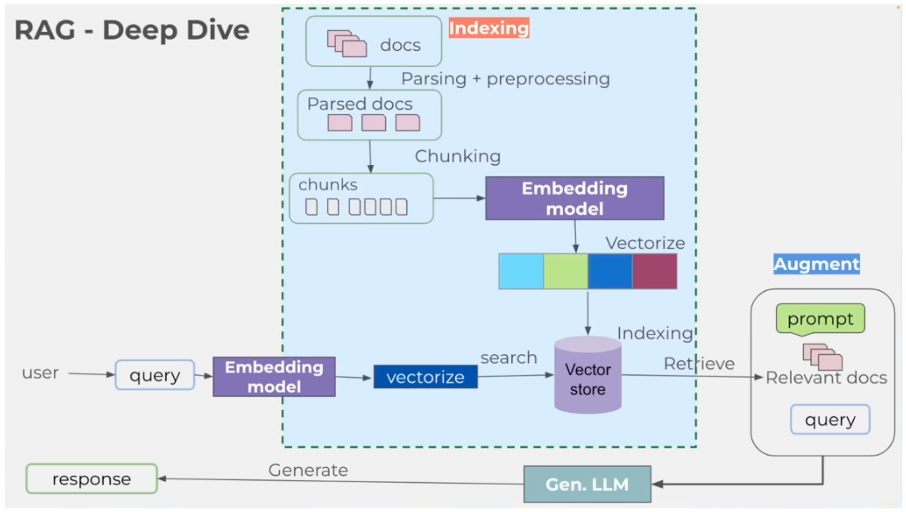

# Exploring Llama

## Introduction
Llama is a language model that can be used to create conversational agents and chatbots.

You can use Llama in four ways:
- As a CLI tool
- As an API endpoint
- As a web interface
- As a Python library

## Installation
To install Llama, run:
```bash
pip install llama
```

### Running Llama
To run Llama, run:
```bash
ollama run llama3.2
```

### Downloading a Model
To download a model, run:
```bash
ollama download llama3.2
```

## Using The CLI
Run `ollama run llama3.2` to enter the ollama CLI.

### New Models – The Modelfile
Create a modelfile to create an new model of llama. Add information as:
```bash
FROM llama3.2

# set temperature to 1
PARAMETER temperature 1

SYSTEM “””
    You are James, a very smart assistant who answers questions succinctly and informatively.
“””
```

To create a new model, on bash, do:
- `ollama create james -f ./Modelfile`
- `ollama list`: shows the inclusion of the new model
- `ollama run james`: runs this new model

## Using the API Endpoint
Llama has an API endpoint that can be used to interact with the model. It is accessible at `http://localhost:11434`.

To use the API endpoint, run:
```bash
curl http://localhost:11434/api/generate -d '{
    "model": "llama3.2",
    "prompt": "Why is the sky blue??",
    "temperature": 1,
    "stream": false
}'
```
Or use `chat` instead of `generate`:
```bash
curl http://localhost:11434/api/chat -d '{
    "model": "llama3.2",
    "messages": [
        {
            "role": "user",
            "content": "Tell ne a fun fact about Brazil"
        }
    ],
    "temperature": 1,
    "stream": false
}'
```

Or generate the output in JSON format:
```bash
curl http://localhost:11434/api/generate -d '{
    "model": "llama3.2",
    "prompt": "Why is the sky blue?",
    "temperature": 1,
    "stream": false
}' | jq
```
or
```bash
curl http://localhost:11434/api/generate -d '{
    "model": "llama3.2",
    "prompt": "Why is the sky blue? Respond using JSON",
    "temperature": 1,
    "format": "json",
    "stream": false
}'
```
For more information on the API, see the [API documentation](https://github.com/ollama/ollama/blob/main/docs/api.md).

## Using the Web Interface (UI)
You can install [Msty](https://msty.app) application to interact with Llama using a web interface.

## Using the Python Library
To start using Llama in Python, setup the virtual environment:
```bash
python3 -m venv .venv
source .venv/bin/activate
pip install requests
pip install ollama
```
The `start-1.py` shows how to interact with Llama using Python.
The `start-2.py` shows how to interact with Llama using the python library.

### Demos
#### Categorization App
The `categorizer.py` shows how to use Llama to categorize text.

#### RAG - Retrieval Augmented Generation Apps
This demo shows how to use Llama building RAG (Retrieval Augmented Generation) models. This
means that the model can retrieve information from a database and generate a response.

RAG Systems Need:
- LLM Models
- Document Corpus (Knowledge Base)
- Document Embeddings
- Vector Store (Vector Database, Faiss, Pinecone, Chromadb, etc.)
- Retrieval System (Retrieval Model)

The image below shows the components of the RAG model:



The LangChain is a tool that makes easy to deal with LLMs and build robust LLM applications.

The image below shows the RAG System Hands-On:


The first example is the `pdf-rag.py` that shows how to use Llama to build a RAG model.
